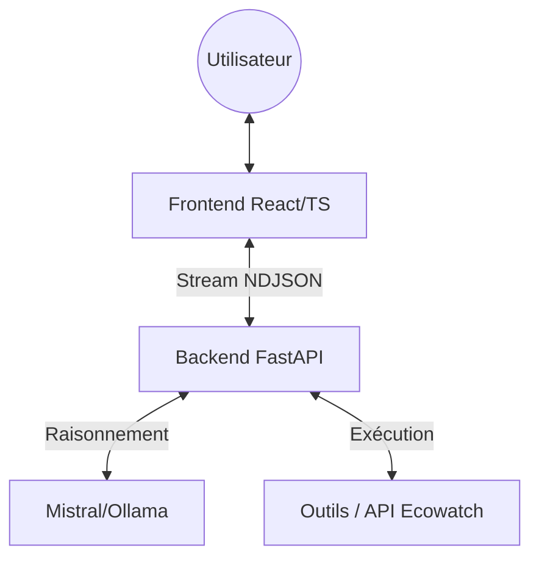
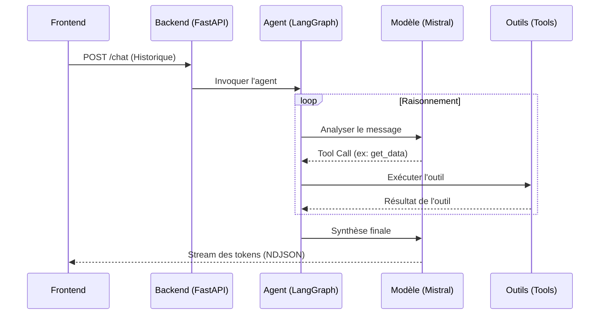

# Architecture de Jarvis

Jarvis est un assistant agentique conçu pour la supervision environnementale. Son architecture repose sur une séparation nette entre le raisonnement (Backend) et l'interface interactive (Frontend).

## Vue d'ensemble technique

Le système est décomposé en trois couches principales :

## 1. Le Backend (Python & LangGraph)

Le cœur de Jarvis est un **Agent d'état (Stateful Agent)** construit avec LangGraph.

### Flux de Raisonnement

L'interaction suit un cycle itératif géré par le graphe :

Le cœur de Jarvis est un **Agent d'état (Stateful Agent)** construit avec LangGraph.

### Orchestration LangGraph
Contrairement à une simple chaîne séquentielle, Jarvis utilise un graphe cyclique :
- **Nodes** : Fonctions Python qui gèrent soit l'appel au modèle, soit l'exécution des outils.
- **Edges** : Logique conditionnelle décidant si l'agent doit continuer à appeler des outils ou répondre à l'utilisateur.

### Modèles supportés
Jarvis utilise une **Factory de Modèles** (`ModelFactory`) permettant de basculer entre :
- **Mistral AI** : Utilisation via l'API cloud pour des capacités de raisonnement avancées.
- **Ollama** : Support de modèles locaux (ex: Qwen, Llama) pour la confidentialité et l'autonomie.

### Système d'Outils (Tools)
L'agent dispose d'un catalogue d'outils typés :
- `get_current_datetime` : Synchronisation temporelle pour le calcul de périodes relatives.
- `ecowatch_sensors` : Suite d'outils pour interagir avec l'API B2B d'Ecowatch (lecture temps réel, historique, listing de devices).
- `generate_sensor_chart` : Générateur de spécifications de visualisation.

## 2. Le Protocole de Communication (NDJSON)

Pour une expérience utilisateur fluide, le backend utilise le format **NDJSON (Newline Delimited JSON)** sur un flux HTTP (`StreamingResponse`).

Chaque ligne du flux représente un événement :
- `{"type": "token", "content": "..."}` : Fragments de texte générés en temps réel.
- `{"type": "tool_start", ...}` : Notification du début d'exécution d'un outil.
- `{"type": "tool_end", ...}` : Résultat de l'outil (données brutes ou spécification de graphique).

## 3. Le Frontend (React & TypeScript)

Le frontend est responsable de l'interprétation du flux et du rendu des composants riches.

### Gestion du flux
Le hook `useChat` implémente un lecteur de stream asynchrone qui :
- Accumule les tokens pour un affichage fluide.
- Gère l'état visuel des "Tool Calls" (indicateurs de chargement, erreurs).
- Extrait les `payloads` riches (comme les graphiques).

### Visualisation de données
Jarvis n'envoie pas d'images. Il envoie une `ChartSpec` (JSON). Le frontend utilise ces données pour instancier des composants de visualisation dynamiques basés sur des bibliothèques de graphiques modernes, garantissant interactivité et performance.

!!! info "Raisonnement de l'agent"
    L'agent est guidé par un `system_prompt` qui définit son identité (JARVIS d'Ecowatch) et ses contraintes de sécurité et de formatage.
